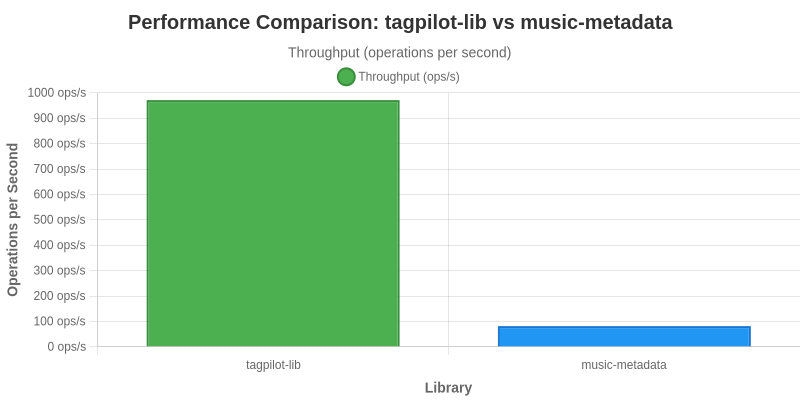

# @yortyrh/tagpilot-lib

[](https://github.com/yortyrh/tagpilot-lib/actions/workflows/CI.yml)
[](https://npmjs.org/package/@yortyrh/tagpilot-lib)
[](https://npmcharts.com/compare/@yortyrh/tagpilot-lib?start=600&interval=30)
[](https://codecov.io/github/yortyrh/tagpilot-lib)
[](https://snyk.io/test/github/yortyrh/tagpilot-lib)

A high-performance Node.js library for reading and writing audio metadata and cover art, built with Rust and NAPI-RS.

## Features

- 🚀 **High Performance**: Native Rust implementation for maximum speed
- 🎵 **Audio Metadata**: Read and write ID3 tags, MP3 metadata, and more
- 🖼️ **Cover Art**: Extract, embed, and manage album artwork
- 📦 **Buffer Support**: Work with audio data directly in memory
- 🔄 **Async/Await**: Promise-based API for modern JavaScript
- 🛡️ **TypeScript**: Full TypeScript support with type definitions
- 🌐 **Cross Platform**: Works on Windows, macOS, and Linux

## Installation

```bash
npm install @yortyrh/tagpilot-lib
```

```bash
yarn add @yortyrh/tagpilot-lib
```

### Cross-Platform Support

The package automatically provides the correct native binary for your platform:

- **Windows**: x64, ARM64, IA32
- **macOS**: x64 (Intel), ARM64 (Apple Silicon)
- **Linux**: x64, ARM64, ARM (GNU and Musl variants)
- **FreeBSD**: x64
- **Android**: ARM, ARM64
- **WebAssembly**: Browser and WASI environments

Each platform gets an optimized binary, ensuring maximum performance on your system.

## Quick Start

```javascript
const { readTags, writeTags, readCoverImageFromBuffer, writeCoverImageToBuffer } = require('@yortyrh/tagpilot-lib')

// Read audio metadata
const tags = await readTags('./music/song.mp3')
console.log(tags.title) // "Song Title"
console.log(tags.artist) // "Artist Name"

// Write audio metadata
await writeTags('./music/song.mp3', {
  title: 'New Title',
  artists: ['New Artist'],
  album: 'Album Name',
  year: 2024,
  genre: 'Rock',
  track: {
    no: 1,
    of: 12,
  },
})

// Read cover image
const coverImage = await readCoverImageFromBuffer(audioBuffer)
if (coverImage) {
  console.log('Cover image found:', coverImage.length, 'bytes')
}

// Write cover image
const imageBuffer = fs.readFileSync('./cover.jpg')
const modifiedAudio = await writeCoverImageToBuffer(audioBuffer, imageBuffer)
```

## API Reference

### Audio Tags

#### `readTags(filePath: string): Promise<AudioTags>`

Reads metadata from an audio file.

**Parameters:**

- `filePath` (string): Path to the audio file

**Returns:** Promise<AudioTags>

**Example:**

```javascript
const tags = await readTags('./music/song.mp3')
console.log(tags)
// {
//   title: "Song Title",
//   artists: ["Artist Name"],
//   album: "Album Name",
//   year: 2024,
//   genre: "Rock",
//   track: {
//     no: 1,
//     of: 12
//   },
//   albumArtists: ["Album Artist"],
//   comment: "Comment",
//   disc: {
//     no: 1,
//     of: 2
//   },
//   image: {
//     data: <Buffer>,
//     mimeType: "image/jpeg",
//     description: "Cover Art"
//   }
// }
```

#### `writeTags(filePath: string, tags: AudioTags): Promise<void>`

Writes metadata to an audio file.

**Parameters:**

- `filePath` (string): Path to the audio file
- `tags` (AudioTags): Metadata to write

**Returns:** Promise<void>

**Example:**

```javascript
await writeTags('./music/song.mp3', {
  title: 'New Title',
  artists: ['New Artist'],
  album: 'Album Name',
  year: 2024,
  genre: 'Rock',
  track: {
    no: 1,
    of: 12,
  },
  albumArtists: ['Album Artist'],
  comment: 'My comment',
  disc: {
    no: 1,
    of: 2,
  },
})
```

#### `clearTags(filePath: string): Promise<void>`

Clears all metadata from an audio file.

**Parameters:**

- `filePath` (string): Path to the audio file

**Returns:** Promise<void>

**Example:**

```javascript
await clearTags('./music/song.mp3')
```

### Buffer Operations

#### `readTagsFromBuffer(buffer: Buffer): Promise<AudioTags>`

Reads metadata from an audio buffer.

**Parameters:**

- `buffer` (Buffer): Audio data buffer

**Returns:** Promise<AudioTags>

**Example:**

```javascript
const audioBuffer = fs.readFileSync('./music/song.mp3')
const tags = await readTagsFromBuffer(audioBuffer)
```

#### `writeTagsToBuffer(buffer: Buffer, tags: AudioTags): Promise<Buffer>`

Writes metadata to an audio buffer and returns the modified buffer.

**Parameters:**

- `buffer` (Buffer): Audio data buffer
- `tags` (AudioTags): Metadata to write

**Returns:** Promise<Buffer>

**Example:**

```javascript
const audioBuffer = fs.readFileSync('./music/song.mp3')
const modifiedBuffer = await writeTagsToBuffer(audioBuffer, {
  title: 'New Title',
  artists: ['New Artist'],
})
fs.writeFileSync('./music/modified-song.mp3', modifiedBuffer)
```

### Cover Art

#### `readCoverImageFromBuffer(buffer: Buffer): Promise<Buffer | null>`

Reads cover art from an audio buffer.

**Parameters:**

- `buffer` (Buffer): Audio data buffer

**Returns:** Promise<Buffer | null>

**Example:**

```javascript
const audioBuffer = fs.readFileSync('./music/song.mp3')
const coverImage = await readCoverImageFromBuffer(audioBuffer)
if (coverImage) {
  fs.writeFileSync('./cover.jpg', coverImage)
}
```

#### `writeCoverImageToBuffer(buffer: Buffer, imageData: Buffer): Promise<Buffer>`

Writes cover art to an audio buffer and returns the modified buffer.

**Parameters:**

- `buffer` (Buffer): Audio data buffer
- `imageData` (Buffer): Image data (JPEG, PNG, GIF, BMP, TIFF)

**Returns:** Promise<Buffer>

**Example:**

```javascript
const audioBuffer = fs.readFileSync('./music/song.mp3')
const imageBuffer = fs.readFileSync('./cover.jpg')
const modifiedAudio = await writeCoverImageToBuffer(audioBuffer, imageBuffer)
fs.writeFileSync('./music/song-with-cover.mp3', modifiedAudio)
```

## Types

### AudioTags

The main interface for audio file metadata, including cover art information.

```typescript
interface AudioTags {
  title?: string // Song title
  artists?: Array<string> // Array of primary artists
  album?: string // Album name
  year?: number // Release year
  genre?: string // Music genre
  track?: Position // Track position information
  albumArtists?: Array<string> // Array of album artists
  comment?: string // Additional comments
  disc?: Position // Disc position information
  image?: Image // Primary cover art (CoverFront type)
  allImages?: Array<Image> // All images, including cover art
}
```

### Position

Represents position information for tracks and discs.

```typescript
interface Position {
  no?: number | null // Current position (track/disc number)
  of?: number | null // Total count (total tracks/discs)
}
```

### Image

Represents cover art information with image data and metadata.

```typescript
interface Image {
  data: Buffer // Raw image data
  mimeType?: string // MIME type (e.g., "image/jpeg")
  description?: string // Optional description of the image
  picType?: string // Picture type (e.g., "CoverFront", "CoverBack", etc.)
}
```

## Examples

### Basic Usage

```javascript
const { readTags, writeTags } = require('@yortyrh/tagpilot-lib')

// Read metadata
const tags = await readTags('./music/song.mp3')
console.log('Title:', tags.title)
console.log('Artist:', tags.artists?.[0])

// Update metadata
await writeTags('./music/song.mp3', {
  title: 'New Title',
  artists: ['New Artist'],
  album: 'New Album',
  year: 2024,
})
```

### Image Handling

The library provides two ways to handle images in audio files:

1. **Single Cover Image** (`image` field):
   - Represents the primary cover image (CoverFront type)
   - Convenient for simple cover art operations
   - Backward compatible with older versions

2. **Multiple Images** (`allImages` field):
   - Contains all images, including the cover art
   - Takes precedence over the `image` field when both are present
   - Automatically ensures cover image (CoverFront) is first in the list
   - Preserves order of non-cover images

```javascript
const { readTags, writeTags } = require('@yortyrh/tagpilot-lib')
const fs = require('fs')

// Read all images
const tags = await readTags('./music/song.mp3')
if (tags.image) {
  console.log('Cover image:', tags.image.data.length, 'bytes')
}
if (tags.allImages) {
  console.log(
    'All images:',
    tags.allImages.map((img) => img.picType),
  )
}

// Write multiple images
await writeTags('./music/song.mp3', {
  // ... other tags ...
  image: {
    data: coverImageBuffer,
    picType: 'CoverFront',
    mimeType: 'image/jpeg',
    description: 'Album cover',
  },
  allImages: [
    {
      data: coverImageBuffer,
      picType: 'CoverFront',
      mimeType: 'image/jpeg',
      description: 'Album cover',
    },
    {
      data: backImageBuffer,
      picType: 'CoverBack',
      mimeType: 'image/jpeg',
      description: 'Album back',
    },
  ],
})
```

### Cover Art Operations

```javascript
const { readCoverImageFromBuffer, writeCoverImageToBuffer } = require('@yortyrh/tagpilot-lib')
const fs = require('fs')

// Read cover art
const audioBuffer = fs.readFileSync('./music/song.mp3')
const coverImage = await readCoverImageFromBuffer(audioBuffer)
if (coverImage) {
  fs.writeFileSync('./cover.jpg', coverImage)
}

// Add cover art
const imageBuffer = fs.readFileSync('./new-cover.jpg')
const modifiedAudio = await writeCoverImageToBuffer(audioBuffer, imageBuffer)
fs.writeFileSync('./music/song-with-cover.mp3', modifiedAudio)
```

### Batch Processing

```javascript
const { readTags, writeTags } = require('@yortyrh/tagpilot-lib')
const fs = require('fs')

// Update all MP3 files in a directory
const files = fs.readdirSync('./music').filter((f) => f.endsWith('.mp3'))
for (const file of files) {
  const tags = await readTags(`./music/${file}`)
  await writeTags(`./music/${file}`, {
    ...tags,
    album: 'My Greatest Hits',
    year: 2024,
  })
  console.log(`Updated: ${file}`)
}
```

## Supported Formats

### Audio Formats

- MP3 (ID3v1, ID3v2)
- FLAC
- M4A (MPEG-4 Audio)
- OGG (Vorbis)
- WAV
- WAVPACK
- AAC
- AIFF
- OPUS
- Speex

### Image Formats

- JPEG
- PNG
- GIF
- BMP
- TIFF

## Performance

@yortyrh/tagpilot-lib is built with Rust and NAPI-RS for maximum performance:

- **Fast**: Native implementation with minimal overhead
- **Memory Efficient**: Direct buffer operations without temporary files
- **Scalable**: Handles large audio files efficiently
- **Concurrent**: Async operations for better throughput

### Benchmark Results

Performance comparison against music-metadata library:



**Key Performance Metrics:**

- **12.3x faster** than music-metadata for reading audio metadata
- **383 ops/s** vs 31 ops/s throughput
- **28ms** vs 338ms average latency
- Tested on 130 audio files across multiple formats (MP3, FLAC, OGG, OPUS, AIFF)

Run the benchmark yourself:

```bash
npm run bench
```

```bash
yarn bench
```

## Development

### Prerequisites

- Node.js 16+
- Rust toolchain
- npm or yarn

### Building from Source

```bash
git clone https://github.com/yortyrh/tagpilot-lib.git
cd tagpilot-lib
npm install
npm run build
```

```bash
git clone https://github.com/yortyrh/tagpilot-lib.git
cd tagpilot-lib
yarn install
yarn build
```

### NPM Artifacts System

The project includes a comprehensive npm artifacts system for cross-platform distribution:

```bash
# Create npm directory structure
yarn create-npm-dirs

# Generate platform-specific packages
yarn generate-npm-packages

# Copy artifacts to npm directories
yarn artifacts

# Prepare for publishing
yarn prepublishOnly
```

This system automatically creates platform-specific packages with the correct native binaries for each target platform. See [NPM_ARTIFACTS_SETUP.md](NPM_ARTIFACTS_SETUP.md) for detailed documentation.

### Running Tests

```bash
npm test
```

### Running Examples

```bash
# Read tags example
node examples/read-tags-example.js ./music/song.mp3

# Write tags example
node examples/write-tags-example.js ./music/song.mp3

# Cover image example
node examples/cover-image-buffer-example.js ./music/song.mp3 ./cover.jpg

# Read cover image as data URL
node examples/read-cover-image-example.js ./music/song.mp3
```

## Contributing

1. Fork the repository
2. Create a feature branch
3. Make your changes
4. Add tests for new functionality
5. Run the test suite
6. Submit a pull request

## License

MIT License - see [LICENSE](LICENSE) file for details.

## Changelog

### v1.0.0

- Initial release
- Audio metadata reading and writing
- Cover art extraction and embedding
- Buffer-based operations
- TypeScript support
- Comprehensive examples

## Support

- **Issues**: [GitHub Issues](https://github.com/yortyrh/tagpilot-lib/issues)
- **Documentation**: [GitHub Wiki](https://github.com/yortyrh/tagpilot-lib/wiki)
- **Discussions**: [GitHub Discussions](https://github.com/yortyrh/tagpilot-lib/discussions)

## Acknowledgments

- Built with [NAPI-RS](https://napi.rs/) for Node.js native addons
- Audio metadata handling powered by [lofty](https://github.com/Serial-ATA/lofty-rs)
- Image format detection using [infer](https://github.com/bojand/infer)
